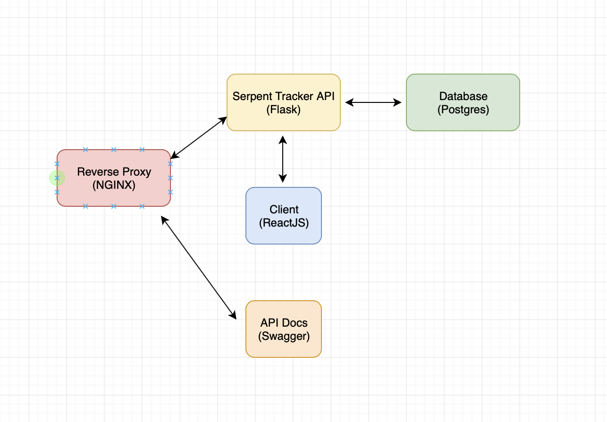

# Serpent Tracker Microservices
The code for all services of serpent tracker

# Documentation
Coming soon...

# Topology


# Dev Setup

## Environment Variables

`export REACT_APP_SERPENT_SERVICE_URL=http://localhost`

`docker-compose -f docker-compose-dev.yml up -d --build`

**Test Users**

username: monty
email: monty@python.org
Pw: greaterthaneight

user: hiss
email: hissy@python.com
Pw: greaterthaneight

## Start
Also ensure you are in the local docker machine context by running the following:

`eval $(docker-machine env -u)`

**Update Swagger JSON**

`python services/swagger/update-spec.py http://localhost`

**Build Images**

`docker-compose -f docker-compose-dev.yml build`

**Run Containers**

`docker-compose -f docker-compose-dev.yml up -d`

**API Routes**
These are the routes that should now be available that you have the application up.

http://localhost - React Client

http://localhost/swagger - Swagger Documentation

http://localhost/api - Flask API Routes

http://localhost/api/users/health - Verify API is up.

**Create & Seed Database**

`docker-compose -f docker-compose-dev.yml run serpentapi python manage.py recreate-db`

`docker-compose -f docker-compose-dev.yml run serpentapi python manage.py seed-db`


## Testing
You can also run the local test.sh file with flags server, client, or e2e to run tests individually:

`sh test.sh server`

`sh test.sh client`

`sh test.sh e2e`

**Run Unit & Integration Tests**

`docker-compose -f docker-compose-dev.yml run serpentapi python manage.py test`

**Linter**

`docker-compose -f docker-compose-dev.yml run serpentapi flake8 project`

**Client Side Tests**

`docker-compose -f docker-compose-dev.yml run client npm test -- --verbose`

**End to End Tests**

`./node_modules/.bin/cypress open --config baseUrl=http://localhost`

**Coverage Report**

`docker-compose -f docker-compose-dev.yml run serpentapi python manage.py cov`

**Manually Enter PSQL**

`docker-compose -f docker-compose-dev.yml exec serpentapi-db psql -U postgres`

## Stopping
To stop the containers:

`docker-compose -f docker-compose-dev.yml stop`

To bring down the containers:

`docker-compose -f docker-compose-dev.yml down`

Test it works:

[http://localhost/api/users/health](http://localhost/api/users/health)


# Development Utils & Commands

## Database Migrations
If doing local development for flask and you do database changes in the models the below commands can help like migrate and upgrade to update the db.

Init - `docker-compose -f docker-compose-dev.yml run serpentapi python manage.py db init`

Migrate - `docker-compose -f docker-compose-dev.yml run serpentapi python manage.py db migrate`

Upgrade - `docker-compose -f docker-compose-dev.yml run serpentapi python manage.py db upgrade`


# Staging Setup
1. Setup env for the staging docker-machine:

`eval $(docker-machine env serpenttracker-stage)`

2. Setup env variables:

`export REACT_APP_SERPENT_SERVICE_URL=http://DOCKER_MACHINE_STAGING_IP`

3. Spin up staging:

`docker-compose -f docker-compose-stage.yml up -d --build`

# Prod Setup
You need to have AWS creds setup in the ~/.aws/credentials file similar to below:

```
[defaults]
aws_access_key_id=Blah
aws_secret_access_key=Blah
```

More information can be found [Here] on setting up AWS credentials(https://docs.aws.amazon.com/cli/latest/userguide/cli-configure-files.html)

## Setup Docker Instance
This will build a docker host on AWS
`docker-machine create --driver amazonec2 serpenttracker-prod`

Now set it as the active host:

```
docker-machine env serpenttracker-prod
eval $(docker-machine env serpenttracker-prod)
```

## Setup ENV Variables
Now that we are in the context of the AWS docker host we need to setup a few ENV variables:

1. Setup random secret_key:

Run python - `python`
This will bring you to a interactive prompt and follow the commands below to get a random value created:

```
>>> import binascii
>>> import os
>>> binascii.hexlify(os.urandom(24))
b'0ccd512f8c3493797a23557c32db38e7d51ed74f14fa7580'
```
Take this value and set it as the secret:

`export SECRET_KEY=0ccd512f8c3493797a23557c32db38e7d51ed74f14fa7580`

2. Grab the IP for the serpenttracker-prod environment variable:

Get the docker machine ip:

`docker-machine ip serpenttracker-prod`

Use this ip in the export below replacing DOCKER_MACHINE_IP:

`export REACT_APP_SERPENT_SERVICE_URL=http://DOCKER_MACHINE_IP`

## Start Up Docker Container
This command will spin up our application on the docker host:

`docker-compose -f docker-compose-prod.yml up -d --build`

Now create and seed the database:

`docker-compose -f docker-compose-prod.yml run serpentapi python manage.py recreate-db`

`docker-compose -f docker-compose-prod.yml run serpentapi python manage.py seed-db`

Ensure port 80 is allowed in the AWS security group for this container via the AWS console EC2 section - Will automate this soon.

Get the IP of the machine - `docker-machine ip serpenttracker-prod`

Now visit [http://docker-machine-ip] and see application.